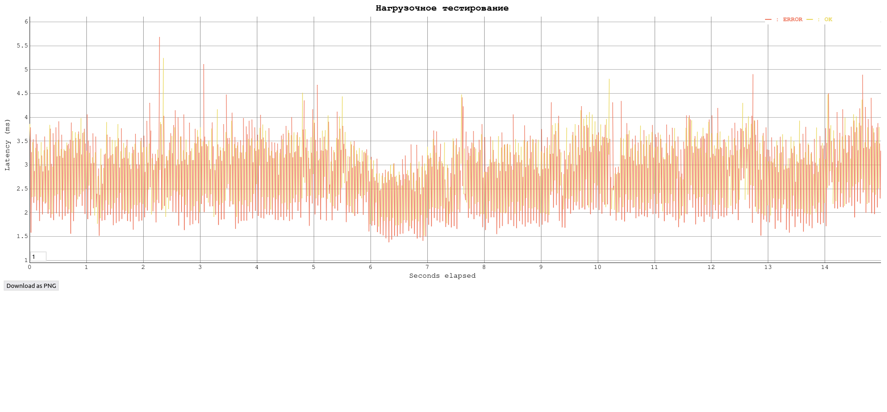
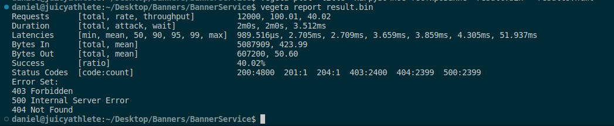

# Banner Service
## Как запустить:
```bash
git clone https://github.com/jusque-a-la-fin/Banner-Service.git && cd Banner-Service && docker-compose up
```
команда для запуска линтеров(запустить в корневой директории):
```
golangci-lint run
```
## Использованные технологии: Go. PostrgeSQL, Redis, Docker
## Замечания
- Пользователь может получать баннеры как из кэша, так и напрямую из базы данных. Кэш реализован с помощью СУБД Redis следующим образом: каждому пользовательскому/админскому токену соответствует один или несколько баннеров. Если параметр use_last_revision=false сервер пытается найти баннер с заданными feature_id и tag_id в кэше.
  1) Если такого баннера в кэше нет, то сервер обращается к базе данных banners_service(основная бд) и считывает оттуда баннер, соответствующий feature_id и tag_id, если он есть. В случае нахождания такого баннера в базе данных, его информация записывается в кэш для данного пользователя(для его токена) вместе с временем записи. И далее баннер отсылается пользователю.
  2) Если баннер в кэше есть, то проверяется его время записи в кэш:
     -Если прошло более 5 минут с момента записи - то сервер идет в базу данных за новым баннером, который соответствует feature_id и tag_id. Старый баннер из кэша удаляется.
     - Если прошло меньше 5 минут, то баннер отсылается пользователю
- При каждом запросе проверяется, есть ли в контексте сессия пользователя. Если её нет, то токен пользователя ищется сначала в базе данных users, хранящей токены обычных пользователей. Если токена там нет, то наличие токена проверяется в базе данных admins, хранящей токены админов. Если и там токена нет, то пользователь не авторизован. При нахождении токена в одной из этих баз данных, он вместе с флагом isAdmin(true, если админ) записывается в сессии в контексте.
- Скрипты на создание бд banner_service и token_storage хранятся в папке sql
- Тесты в папке test. Запуск тестов в docker-контейнере:
```
docker exec -it $(docker ps -l -q) sh -c "cd test && go test"
```
или
```
docker exec -it id_контейнера sh -c "cd test && go test"
```
## Дополнительно:
- Конфигурация линтеров описана здесь: [golangci.yml](golangci.yml)
- Дополнительные тесты для других эндпоинтов в папке test
- Результаты нагрузочного тестирования (15 c) здесь:  или здесь  Выполнено с помощью Vegeta для 5 запросов по всем эндпоинтам. Список запросов можно посмотреть здесь: [target.list](target.list) Чтобы запустить тестирование:
```
vegeta attack -duration=15s -rate=100 -targets=target.list -output=result.bin
```
Чтобы получить html-отчет:
```
vegeta plot -title='Нагрузочное тестирование' result.bin > results.html
```
Чтобы получить отчет в формате json:
```
vegeta report result.bin
```
## Запросы: 
Для /user_banner (получение баннера для пользователя):
- Баннер получен:
  ```
  curl -X GET "http://localhost:8080/user_banner?tag_id=2&feature_id=1&use_last_revision=false" -H "token: user_token" -i
  ```
  
- Некорректные данные:
  ```
  curl -X GET "http://localhost:8080/user_banner?tag_id=a&feature_id=1&use_last_revision=false" -H "token: user_token" -i
  ```
  
- Пользователь не авторизован:
  ```
  curl -X GET "http://localhost:8080/user_banner?tag_id=a&feature_id=1&use_last_revision=false" -H "token: user1_token" -i
  ```
  
- Пользователь не имеет доступа:
  ```
  curl -X GET "http://localhost:8080/user_banner?tag_id=3&feature_id=7&use_last_revision=false" -H "token: user_token" -i
  ```
  
- Баннер не найден:
  ```
  curl -X GET "http://localhost:8080/user_banner?tag_id=8&feature_id=1&use_last_revision=false" -H "token: user_token" -i
  ```

Для /banner (получение всех баннеров c фильтрацией по фиче и/или тегу ):
- Баннеры получены:
  ```
  curl -X GET "http://localhost:8080/banner?feature_id=3&limit=5&offset=0" -H "token: admin_token" -i
  ```
  
- Пользователь не авторизован:
  ```
  curl -X GET "http://localhost:8080/banner?feature_id=3&limit=5&offset=0" -H "token: admin1_token" -i
  ```
  
- Пользователь не имеет доступа:
  ```
  curl -X GET "http://localhost:8080/banner?feature_id=3&limit=5&offset=0" -H "token: user_token" -i
  ```

Для /banner (создание нового баннера):
- Created:
  ```
  curl -X POST -H "Content-Type: application/json" -H "token: admin_token" -d '{"tag_ids": [2, 3, 5], "feature_id": 3, "content": {"title": "title_14", "text": "text14", "url": "url16"}, "is_active": true}' http://localhost:8080/banner -i
  ```

- Некорректные даынне:
  ```
  curl -X POST -H "Content-Type: application/json" -H "token: admin_token" -d '{"tag_ids": [2, 3, 5], "feature_id": a, "content": {"title": "tit14", "text": "te14", "url": "u15"}, "is_active": true}' http://localhost:8080/banner -i
  ```

- Пользователь не авторизован:
  ``` 
  curl -X POST -H "Content-Type: application/json" -H "token: admn_token" -d '{"tag_ids": [2, 3, 5], "feature_id": a, "content": {"title": "tit14", "text": "te14", "url": "u15"}, "is_active": true}' http://localhost:8080/banner -i
  ```

- Пользователь не имеет доступа:
  ```
  curl -X POST -H "Content-Type: application/json" -H "token: user_token" -d '{"tag_ids": [2, 3, 5], "feature_id": a, "content": {"title": "tt14", "text": "t14", "url": "u5"}, "is_active": true}' http://localhost:8080/banner -i
  ```

- Внутренная ошибка сервера(при попытке создать уже существующий баннер):
  ```
   curl -X POST -H "Content-Type: application/json" -H "token: admin_token" -d '{"tag_ids": [2, 3, 5], "feature_id": 3, "content": {"title": "title_14", "text": "text14", "url": "url16"}, "is_active": true}' http://localhost:8080/banner -i
  ```

Для /banner/{id} (обновление содержимого баннера):
- OK:
  ```
  curl -X PATCH -H "Content-Type: application/json" -H "token: admin_token" -d '{"tag_ids": [2, 3], "feature_id": 3, "content": {"title": "sotle_17", "text": "sotext18", "url": "sourl19"}, "is_active": true}' http://localhost:8080/banner/1 -i
  ```

- Некорректные данные:
  ```
  curl -X PATCH -H "Content-Type: application/json" -H "token: admin_token" -d '{"tag_ids": [3], "feature_id": a, "content": {"title": "so_17", "text": "st8", "url": "rl9"}, "is_active": true}' http://localhost:8080/banner/1 -i
  ```

- Пользователь не авторизован:
  ```
  curl -X PATCH -H "Content-Type: application/json" -H "token: a_token" -d '{"tag_ids": [3], "feature_id": 3, "content": {"title": "so17", "text": "s8", "url": "rl"}, "is_active": true}' http://localhost:8080/banner/1 -i
  ```

- Пользователь не имеет доступа:
  ``` 
  curl -X PATCH -H "Content-Type: application/json" -H "token: user_token" -d '{"tag_ids": [3], "feature_id": 3, "content": {"title": "s7", "text": "s8", "url": "rl"}, "is_active": true}' http://localhost:8080/banner/1 -i
  ```

- Баннер не найден:
  ```
  curl -X PATCH -H "Content-Type: application/json" -H "token: admin_token" -d '{"tag_ids": [2, 3], "feature_id": 3, "content": {"title": "se7", "text": "s18", "url": "s19"}, "is_active": true}' http://localhost:8080/banner/1703 -i
  ```

Для /banner/{id} (удаление баннера по идентификатору):
- Баннер успешно удален:
  ```
  curl -X DELETE "http://localhost:8080/banner/1" -H "Content-Type: application/json" -H "token: admin_token" -i
  ```
  
- Некорректные данные:
  ```
  curl -X DELETE "http://localhost:8080/banner/a" -H "Content-Type: application/json" -H "token: admin_token" -i
  ```
  
- Пользователь не авторизован:
  ```
  curl -X DELETE "http://localhost:8080/banner/1" -H "Content-Type: application/json" -H "token: user1_token" -i
  ```
  
- Пользователь не имеет доступа:
  ```
  curl -X DELETE "http://localhost:8080/banner/1" -H "Content-Type: application/json" -H "token: user_token" -i
  ```

- Баннер для тэга не найден:
  ```
  curl -X DELETE "http://localhost:8080/banner/1703" -H "Content-Type: application/json" -H "token: admin_token" -i
  ```
 

